# Diagrama de Classes — Clínica VidaPlena (AV2)

Diagrama em Mermaid (renderiza automaticamente no GitHub). Mostra as hierarquias, as interfaces e os relacionamentos (associação, agregação e composição).

```mermaid
classDiagram
    direction LR

    %% ===== Interfaces =====
    class Agendavel {
        <<interface>>
        +agendar()
        +cancelar()
        +remarcar(novaData, novoHorario)
    }
    class Exportavel {
        <<interface>>
        +exportarDados() String
    }

    %% ===== Hierarquia Pessoa (3 niveis) =====
    class Pessoa {
        <<abstract>>
        #nome : String
        #cpf : String
        #telefone : String
        #dataNascimento : String
        +exibirResumo()* String
        +identificacao() String
    }
    class Paciente {
        -idade : int
        -ativo : boolean
        +exibirResumo() String
        +complementar(...)
        +desativar()
    }
    class Profissional {
        <<abstract>>
        -especialidade : String
        -registroProfissional : String
        -valorConsulta : double
        #descricaoBase() String
        +registrarEspecifico(Atendimento)*
        +atendeNoDia(dia) boolean
    }
    class Fisioterapeuta {
        -totalSessoesPrevistas : int
        +exibirResumo() String
        +registrarEspecifico(Atendimento)
    }
    class Psicologo {
        -abordagem : String
        +exibirResumo() String
        +registrarEspecifico(Atendimento)
    }
    class Nutricionista {
        -planoAlimentar : String
        +exibirResumo() String
        +registrarEspecifico(Atendimento)
    }
    class ClinicoGeral {
        -encaminhamento : String
        +exibirResumo() String
        +registrarEspecifico(Atendimento)
    }

    Pessoa <|-- Paciente
    Pessoa <|-- Profissional
    Profissional <|-- Fisioterapeuta
    Profissional <|-- Psicologo
    Profissional <|-- Nutricionista
    Profissional <|-- ClinicoGeral

    %% ===== Hierarquia Pagamento =====
    class Pagamento {
        <<abstract>>
        #valorBase : double
        #descricao : String
        +calcularValorFinal()* double
        +exportarDados() String
    }
    class PagamentoDinheiro {
        +calcularValorFinal() double
    }
    class PagamentoCartao {
        -parcelas : int
        +calcularValorFinal() double
    }
    class PagamentoConvenio {
        -especialidade : String
        +calcularValorFinal() double
    }
    Pagamento <|-- PagamentoDinheiro
    Pagamento <|-- PagamentoCartao
    Pagamento <|-- PagamentoConvenio
    Pagamento ..|> Exportavel

    %% ===== Consulta / Atendimento / Prontuario =====
    class Consulta {
        -cpfPaciente : String
        -nomeProfissional : String
        -data : String
        -horario : String
        -status : String
        -multa : double
        +exportarDados() String
    }
    class Atendimento {
        -indiceConsulta : int
        +exportarDados() String
    }
    class Prontuario {
        -observacoes : String
        -diagnostico : String
        -procedimentos : List~String~
        -data : String
    }
    Consulta ..|> Agendavel
    Consulta ..|> Exportavel
    Atendimento ..|> Exportavel

    %% ===== Entidades de relacionamento =====
    class Convenio {
        -nome : String
        -percentualCobertura : double
        -especialidadesCobertas : List~String~
        +cobreEspecialidade(esp) boolean
    }
    class HorarioDisponivel {
        -diaSemana : String
        -turno : String
    }

    %% Associacao: Paciente conhece Convenio (existem independentemente)
    Paciente --> Convenio : associacao
    %% Agregacao: Profissional possui horarios (sobrevivem sem o profissional)
    Profissional o-- HorarioDisponivel : agregacao
    %% Composicao: Prontuario so existe dentro de Atendimento
    Atendimento *-- Prontuario : composicao
    %% Associacao: PagamentoConvenio usa um Convenio
    PagamentoConvenio --> Convenio : associacao

    %% ===== Excecoes personalizadas =====
    class Exception
    class PacienteInativoException
    class PacienteNaoEncontradoException
    class ProfissionalNaoEncontradoException
    class HorarioIndisponivelException
    class ConsultaNaoEncontradaException
    class OperacaoInvalidaException
    class PagamentoInvalidoException
    class ConvenioNaoCobreException
    Exception <|-- PacienteInativoException
    Exception <|-- PacienteNaoEncontradoException
    Exception <|-- ProfissionalNaoEncontradoException
    Exception <|-- HorarioIndisponivelException
    Exception <|-- ConsultaNaoEncontradaException
    Exception <|-- OperacaoInvalidaException
    Exception <|-- PagamentoInvalidoException
    Exception <|-- ConvenioNaoCobreException
```

## Legenda dos relacionamentos

- `<|--` herança (ex.: `Fisioterapeuta` é um `Profissional`, que é uma `Pessoa`).
- `..|>` implementação de interface (`Consulta` implementa `Agendavel` e `Exportavel`).
- `-->` **associação**: `Paciente` conhece `Convenio`, mas ambos existem de forma independente.
- `o--` **agregação**: `Profissional` possui uma lista de `HorarioDisponivel`; os horários sobrevivem sem o profissional.
- `*--` **composição**: `Prontuario` só existe dentro de `Atendimento`; se o atendimento é removido, o prontuário também é.
